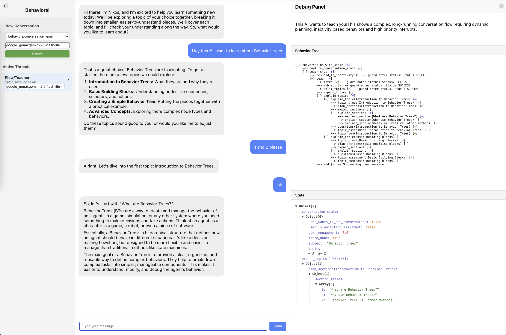

# Behavioral Demo

Interact with our behavior examples.

<p align="center">
    
</p>

This is a React-based UI for interacting with conversation behavior trees.

## Setup and Installation

### Backend Setup

1. Install `behavioral`:
   ```
   pip install -e .
   ```

2. Install you favorit langchain AI model and set its credentials in the environment. The demo server can use all LangChain models. For example for Google models:
   ```
   pip install langchain-google-genai
   export GOOGLE_API_KEY="..."
   ```

3. Start the Backend server:
   ```
   python demo/app.py
   ```

### Frontend Setup

1. Navigate to the react-chat-ui directory:
   ```
   cd demo/ui
   ```

2. Install Node.js dependencies:
   ```
   npm install
   ```

3. Start the React development server:
   ```
   npm start
   ```

4. The chat UI will be available at [http://localhost:3000](http://localhost:3000)

## Features

- Real-time chat interface with the behavior tree
- Debug panel showing the conversation state
- Visual representation of the behavior tree structure